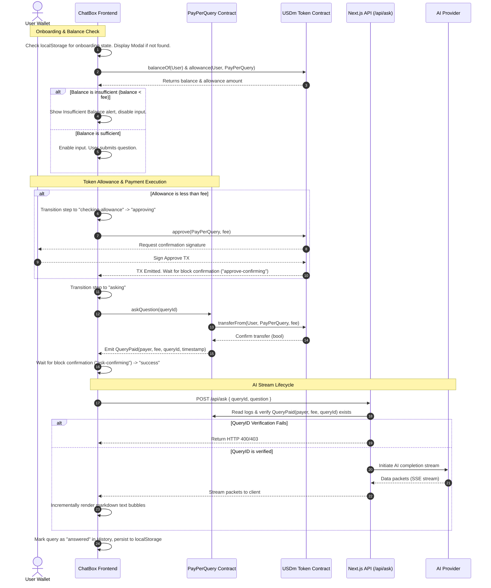

# AskPay: Decentralized Pay-Per-Query AI Assistant

AskPay is a production-grade, decentralized utility-based AI chat application optimized for Celo's **MiniPay** mobile browser and desktop Web3 wallets. By implementing a frictionless micro-payment protocol on the Celo blockchain using the USDm stablecoin, AskPay eliminates high-barrier subscription models, traditional user registration, and data harvesting. Users pay only for what they consume: one query at a time, settled instantly on-chain.

---

## 📖 Table of Contents
1. [Core Design & Architecture](#-core-design--architecture)
2. [Sequence & Lifecycle Flow](#-sequence--lifecycle-flow)
3. [Monorepo Directory Structure](#-monorepo-directory-structure)
4. [Smart Contract Architecture & ABIs](#-smart-contract-architecture--abis)
5. [Frontend Router & Page Specs](#-frontend-router-and-page-specs)
6. [Component Reference Guide](#-component-reference-guide)
7. [API & Rate Limiting Infrastructure](#-api--rate-limiting-infrastructure)
8. [Setup & Development Guide](#-setup--development-guide)
9. [Verification & Testing Suites](#-verification--testing-suites)
10. [Owner Runbook & Operations](#-owner-runbook--operations)
11. [Troubleshooting & FAQ](#-troubleshooting--faq)
12. [License](#-license)

---

## ⚡ Core Design & Architecture

AskPay is engineered under three architectural invariants: **Zero Custody**, **Strict Utility**, and **Maximum Accessibility**.

```
                           +------------------------+
                           |   Celo Blockchain      |
                           |   (Sepolia/Mainnet)    |
                           +-----------+------------+
                                       ^
                                       | 1. Pay fee (QueryPaid event)
                                       v
+--------------------+     2. QueryID  +--------------------+     3. Stream LLM
|   React Frontend   +----------------->  Next.js Backend   +-----------------> User
| (MiniPay/Rainbow)  |                 |   API Handler      |                   Answer
+--------------------+                 +--------------------+
```

### 1. Stablecoin Mapping (USDm vs. USDC/USDT)
Unlike Ethereum mainnet where USDC or USDT are typically used, AskPay operates primarily on Celo's native USDm stablecoin. A crucial technical detail is decimal precision:
- **USDC/USDT** use **6 decimal places**.
- **USDm** uses **18 decimal places** (matching ether/wei unit scales). 
- All frontend conversions and smart contract storage use standard 18-decimal big integers to avoid truncation and mismatch issues.

### 2. Double-Charge Protection & Stream Retry Cache
To protect user funds in volatile mobile network environments:
- Client-side queries generate a cryptographic, single-use `queryId` (via `generateQueryId()`).
- If an LLM stream terminates abnormally, is rate-limited, or disconnects mid-response, the frontend enables a **Retry** action.
- The retry request re-transmits the original `queryId`. The backend API validates that the payment transaction for this specific `queryId` was already verified, allowing the LLM stream to restart without initiating a new Web3 transaction.

### 3. HSL CSS variables & Prev-paint Hydration
The user interface implements a strict light/dark system. To eliminate the "flash of incorrect theme" common in SSR/static Next.js setups, a lightweight, blocking script is injected directly into the `<head>` of the root `layout.tsx`. This script reads `localStorage` before the browser performs its initial layout paint, adding or removing the `.dark` class immediately.

---

## 🔄 Sequence & Lifecycle Flow

Below is the exhaustive transaction-to-stream execution lifecycle:



---

## 📦 Monorepo Directory Structure

The project is styled using a modern Turborepo configuration with pnpm workspaces. Here is a directory map detailing the location and purpose of crucial project modules:

```
AskPay/
├── MEMORY.md                          # Live pair-programming context memory log
├── README.md                          # Comprehensive project documentation
└── askpay-app/
    ├── apps/
    │   ├── contracts/                 # Smart contracts workspace (Hardhat)
    │   │   ├── contracts/             # Solidity contracts
    │   │   │   ├── MockERC20.sol      # ERC20 mock used for Celo Sepolia USDm testing
    │   │   │   └── PayPerQuery.sol    # Canonical payment gateway contract
    │   │   ├── ignition/              # Hardhat Ignition deployment modules
    │   │   ├── scripts/               # Utility scripts (minting, owner updates)
    │   │   ├── test/                  # Chai/Mocha tests for contract functions
    │   │   └── hardhat.config.ts      # Compiler configurations
    │   │
    │   └── web/                       # Next.js frontend workspace
    │       ├── src/
    │       │   ├── app/               # Next.js App Router root
    │       │   │   ├── admin/         # Owner dashboard panel
    │       │   │   ├── api/           # Next.js API endpoints
    │       │   │   │   ├── ask/       # AI stream verification endpoint
    │       │   │   │   └── admin/     # Request logs telemetry data endpoint
    │       │   │   ├── dashboard/     # User analytics page (SVG charts)
    │       │   │   ├── referrals/     # Wallet referral codes link generator
    │       │   │   ├── layout.tsx     # Global layout (providers & scripts wrapper)
    │       │   │   └── page.tsx       # Landing page (renders main ChatBox)
    │       │   │
    │       │   ├── components/        # Shared components directory
    │       │   │   ├── chat-box.tsx   # Core chat container & payment handler
    │       │   │   ├── toast.tsx      # Multi-state global notification toast
    │       │   │   ├── usage-chart.tsx# Custom SVG responsive usage bar chart
    │       │   │   ├── navbar.tsx     # Site navigation & system config toggles
    │       │   │   └── onboarding-modal.tsx # Intro modal step-by-step tour
    │       │   │
    │       │   ├── hooks/             # Custom state hooks
    │       │   │   ├── useAskPay.ts   # Blockchain reads, balance check & askQuestion triggers
    │       │   │   ├── useMiniPay.ts  # Injected wallet & browser detection
    │       │   │   └── useLanguage.tsx# Translations hook for english/swahili context
    │       │   │
    │       │   ├── lib/               # Shared libraries & context providers
    │       │   │   ├── contracts.ts   # Contract address maps and trim ABIs
    │       │   │   ├── theme-context.tsx # Light/dark mode context toggler
    │       │   │   ├── notification-context.tsx # Global system-wide notification dispatch
    │       │   │   └── translations.ts# English & Swahili i18n JSON values
    │       │   │
    │       │   └── test/              # Vitest support configuration & custom utilities
    │       │
    │       ├── tailwind.config.js     # Tailwind themes mapped to CSS HSL values
    │       └── tsconfig.json          # TypeScript compilation configuration
```

---

## 📜 Smart Contract Architecture & ABIs

### 1. `PayPerQuery.sol`
A simple, gas-optimized payment gateway. It stores no pooled user capital beyond standard USDm payments collected.

#### State Variables
- `paymentToken`: Address of the USDm ERC20 token (immutable).
- `fee`: Cost of one query in token wei (uint256, editable by owner).

#### Key Functions
- `askQuestion(uint256 queryId)`: Pulls `fee` amount of tokens from user using `transferFrom` and logs the payment with a `QueryPaid` event.
- `withdraw()`: Transfers contract token balances to the owner address.
- `setFee(uint256 newFee)`: Updates query pricing (minimum value must be `> 0`).

#### Events
```solidity
event QueryPaid(address indexed payer, uint256 amount, uint256 indexed queryId, uint256 timestamp);
event FeeUpdated(uint256 oldFee, uint256 newFee);
event Withdrawn(address indexed to, uint256 amount);
```

### 2. Canonical ABI definitions (Trimmed)
The frontend utilizes a minimal ABI to optimize execution overhead and reduce bundle sizes.

```typescript
export const PAY_PER_QUERY_ABI = [
  {
    inputs: [],
    name: "fee",
    outputs: [{ name: "", type: "uint256" }],
    stateMutability: "view",
    type: "function",
  },
  {
    inputs: [{ name: "queryId", type: "uint256" }],
    name: "askQuestion",
    outputs: [],
    stateMutability: "nonpayable",
    type: "function",
  },
  {
    inputs: [],
    name: "owner",
    outputs: [{ name: "", type: "address" }],
    stateMutability: "view",
    type: "function",
  },
  {
    inputs: [],
    name: "withdraw",
    outputs: [],
    stateMutability: "nonpayable",
    type: "function",
  },
  {
    inputs: [{ name: "newFee", type: "uint256" }],
    name: "setFee",
    outputs: [],
    stateMutability: "nonpayable",
    type: "function",
  }
] as const;
```

---

## 🌐 Frontend Router and Page Specs

AskPay leverages Next.js App Router structures to render its distinct modules:

| Path | Mode | Description |
|---|---|---|
| `/` | Client | Landing container mounting the onboarding wrapper, FAQ accordion, and primary chat input boxes. |
| `/dashboard` | Client | Personalized stats engine parsing `localStorage` data metrics to build usage graphs, spending charts, average speeds, and query indices. |
| `/referrals` | Client | Interlocks with the active `wagmi` address to compute share links (`/?ref=<addr>`). Discloses a friendly placeholder metrics view. |
| `/admin` | Client | Locked to owner addresses (retrieved via `owner()` contract calls). Queries all on-chain `QueryPaid` event logs to plot query metrics and logs. |
| `/how-it-works` | Client | Detailed documentation step guides on stablecoins, micro-transactions, and security details. Translates fully into Swahili. |
| `/pricing` | Client | Displays pricing options showing the pay-per-use structure against standard monthly tier subscriptions. |
| `/legal` | Client | Privacy policies and terms of services written in local and native translations. |
| `/roadmap` | Client | Project changelogs, upcoming feature rollouts, and milestones. |
| `/credits` | Client | Developer credits, open-source attributions, and contributor bios. |

---

## 🧩 Component Reference Guide

### 1. `ChatBox` (`/components/chat-box.tsx`)
The central coordinator of the application. It maps local form states, active user selections, and historical queries.
- **Wagmi Integrations:** `useAccount` determines button states (Connect vs. Ask).
- **Insufficiency Alerts:** Watches balance outputs from `useAskPay` dynamically against contract fees, disabling input submission when limits are breached.
- **Status badges:** Rendered dynamically based on active transaction states.

### 2. `UsageChart` (`/components/usage-chart.tsx`)
A dependency-free SVG chart rendering engine:
- Computes time series maps for query volumes over 14 trailing days.
- Scales layouts programmatically to form standard bar and line layouts.
- Includes responsive screen resize attributes using standard React state listeners.

### 3. `OnboardingModal` (`/components/onboarding-modal.tsx`)
- **Activation Check:** Instantiated via `OnboardingWrapper`. Displays immediately if `askpay_onboarding_seen` key is absent from `localStorage`.
- **Carousel Steps:** Integrates 3 styled steps using custom SVG vectors, progress dots, and slide navigation button handlers.
- **CTA Adaptability:** Adapts action text based on whether a wallet is already connected.

### 4. `Toast` (`/components/toast.tsx`)
- **Portal Rendering:** Injected directly into the document root layout above standard footers to bypass container nesting layout overflows.
- **Lifecycle Updates:** Listens to `state.step` transitions to mutate a single loading notification in-place, keeping layout noise to a minimum.
- **Progress bar animation:** Uses standard CSS keyframes to drain the progress indicators in lockstep with auto-dismiss timers.

---

## 🔒 API & Rate Limiting Infrastructure

### 1. IP-Based Sliding Window Rate Limiting
To prevent denial-of-service attempts and control backend cost vectors, requests are evaluated inside `apps/web/src/middleware.ts` before reaching the LLM handler.
- **Mechanism:** Implements a sliding window algorithm leveraging an in-memory memory map (`Map<string, { count: number; resetsAt: number }>`).
- **IP Extraction:** Parses incoming `x-forwarded-for` and standard headers.
- **HTTP Response:** Blocked requests return an HTTP `429 Too Many Requests` code with a detailed `Retry-After` header.

### 2. `/api/ask` Flow
This route validates transactions before communicating with LLM services.
1. Receives `queryId` and `question`.
2. Initiates a `viem` contract log scan to fetch `QueryPaid` events matching the target `queryId`.
3. If no matching on-chain event is found within block boundaries, the request terminates immediately with an HTTP `403 Forbidden` response.
4. If found, a streaming response is generated and sent via Server-Sent Events (SSE).

---

## ⚙️ Setup & Development Guide

Follow these steps to run the complete environment locally:

### 1. Environment Configurations
Verify you have configured `.env.local` files inside `apps/web` and `.env` files in `apps/contracts`. See the [Setup section](#-local-development--setup) for template structures.

### 2. Running Contract Nodes
To develop and run queries against a mock token locally, start a local Hardhat node:
```bash
cd apps/contracts
pnpm hardhat node
```
Keep this terminal window open. In a new terminal, deploy the contract suite to the localhost node:
```bash
pnpm hardhat run scripts/deploy.ts --network localhost
```

### 3. Running Web App Dev Server
Run the Turborepo package manager to start development processes:
```bash
# Return to the monorepo root
cd ../..
pnpm --filter web dev
```

---

## 🧪 Verification & Testing Suites

Our testing infrastructure includes isolated environments for both Web3 contract routines and UI layout states.

### 1. Smart Contract Tests (`/apps/contracts/test`)
Tests check fee administration, security validations, and proper event emission.

To execute contract tests:
```bash
cd apps/contracts
pnpm hardhat test
```

Expected contract test logs resemble:
```
  PayPerQuery
    Deployment
      ✔ sets the correct owner
      ✔ sets the initial fee correctly
      ✔ stores the payment token address
    askQuestion
      ✔ transfers the fee from the user to the contract
      ✔ emits QueryPaid with correct payer, amount, and queryId
      ✔ reverts when the user has not approved enough tokens
    withdraw
      ✔ reverts when called by a non-owner
      ✔ transfers full balance to the owner when called by owner
    setFee
      ✔ allows owner to update the fee

  24 passing (1s)
```

### 2. Frontend Tests (`/apps/web/src/components/__tests__`)
Unit tests verify that user interactions, language transitions, wallet checks, and error displays operate correctly.

To run frontend tests:
```bash
cd apps/web
pnpm test
```

We mock `wagmi` hooks and Celo parameters inside the test harness to isolate UI components during tests.

---

## 👑 Owner Runbook & Operations

### 1. Adjusting Query Fees
The contract owner can update the fee per question. Gas costs on Celo Sepolia are extremely low, making updates fast and inexpensive.
Execute the utility script:
```bash
cd apps/contracts
pnpm hardhat run scripts/set-fee.ts --network celoSepolia
```
*Make sure to configure the correct update parameter inside the script before executing.*

### 2. Withdrawing Contract Balances
To sweep collected USDm payments from the `PayPerQuery` address into the owner address:
```bash
pnpm hardhat run scripts/withdraw.ts --network celoSepolia
```
This transaction calls `PayPerQuery.withdraw()`, emitting a `Withdrawn` event log on success.

---

## ❓ Troubleshooting & FAQ

#### Q: The Chat Box says "Insufficient USDm balance" even though I have CELO tokens.
**A:** AskPay uses the **USDm** stablecoin for query payments, not Celo's native gas token (CELO). When running on Celo Sepolia, use the provided testnet mint script to receive mock USDm tokens:
```bash
cd apps/contracts
pnpm hardhat run scripts/mint-mock-usdm.ts --network celoSepolia
```

#### Q: How do I switch the application to run on Celo Mainnet?
**A:** Update the `NEXT_PUBLIC_NETWORK` variable in `apps/web/.env.local` to `"mainnet"` and configure the corresponding contract addresses. The application will automatically adapt to mainnet configurations, including updating RainbowKit themes, Celo RPC parameters, and Explorer paths.

#### Q: What happens if the AI streaming fails mid-response?
**A:** The frontend includes a **Retry** option. If a stream fails after payment is confirmed, you can restart the query. The backend checks for the existing payment confirmation on-chain and resumes the stream without charging your wallet again.

---

## 📜 License

This project is open-source software licensed under the [MIT License](LICENSE).